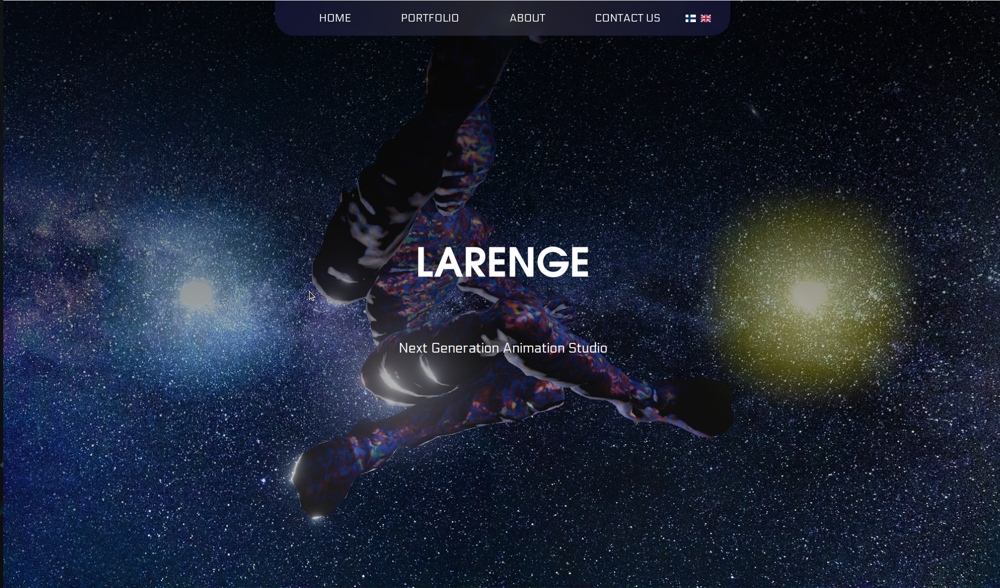
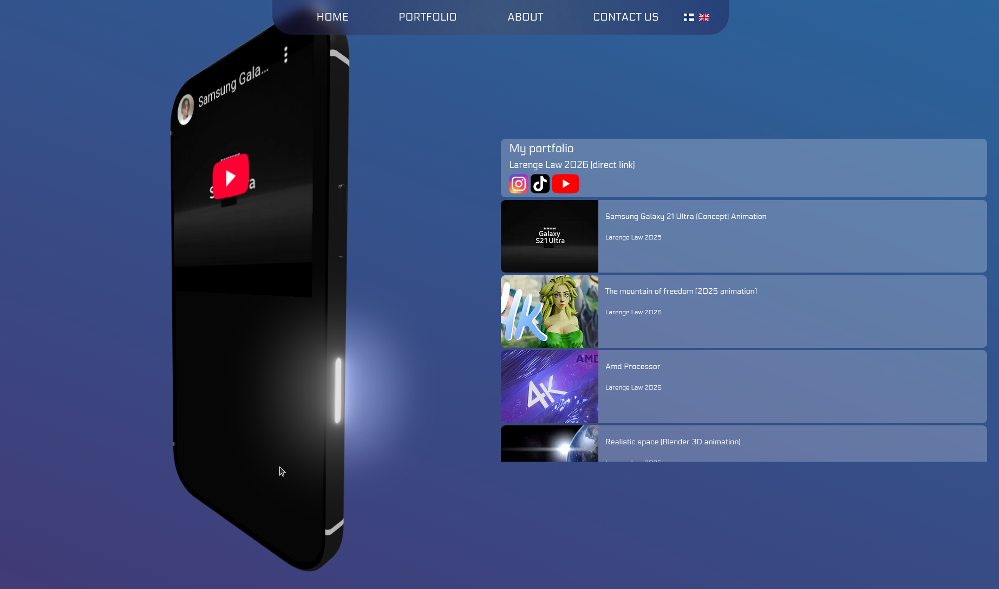

# 3D Website (nextjs, three.js)

## Try the page
<a href="https://akinlawrence.github.io/lareweb-demo">Link to the website</a>

## About the project
The site includes interactive 3D elements that make it more engaging and modern. Its clean layout, appealing colors, and smooth visuals are designed to create an attractive and easy-to-use experience for visitors.

# Why was this project made
It was created for a company and now its here too as demo.

# Plans for project
Currently there isn't any upcoming plans but it will optimized more on the mobile overtime.

## A Quick look of the front page

## The Exam it self

